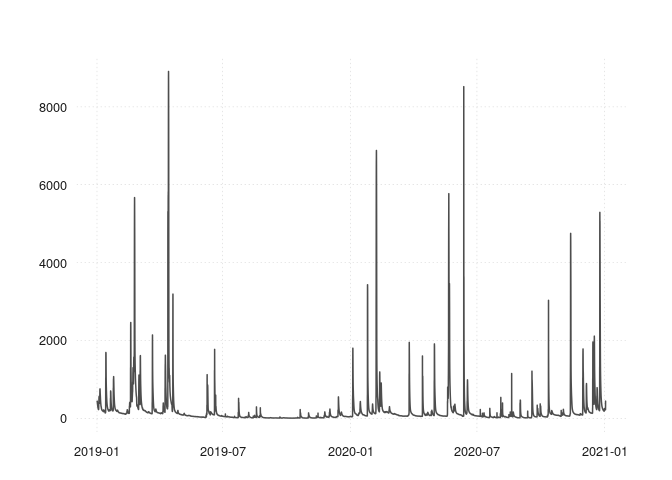
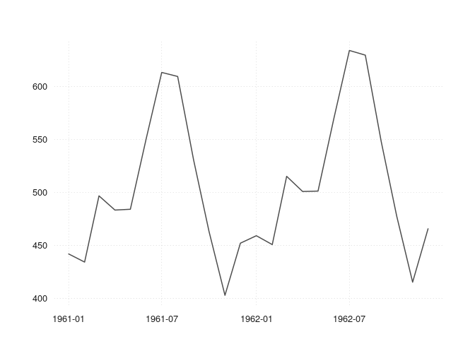
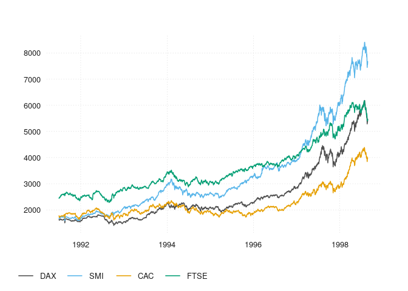

tsbox review
================
nunesmatt
30/09/2022

## Package Review

*Please check off boxes as applicable, and elaborate in comments below.
Your review is not limited to these topics, as described in the reviewer
guide*

  - **Briefly describe any working relationship you have (had) with the
    package authors.**
  - [x] As the reviewer I confirm that there are no [conflicts of
    interest](https://devguide.ropensci.org/policies.html#coi) for me to
    review this work (if you are unsure whether you are in conflict,
    please speak to your editor *before* starting your review).

#### Documentation

The package includes all the following forms of documentation:

  - [x] **A statement of need:** clearly stating problems the software
    is designed to solve and its target audience in README
  - [x] **Installation instructions:** for the development version of
    package and any non-standard dependencies in README
  - [x] **Vignette(s):** demonstrating major functionality that runs
    successfully locally
  - [x] **Function Documentation:** for all exported functions
  - [x] **Examples:** (that run successfully locally) for all exported
    functions
  - [x] **Community guidelines:** including contribution guidelines in
    the README or CONTRIBUTING, and DESCRIPTION with `URL`, `BugReports`
    and `Maintainer` (which may be autogenerated via `Authors@R`).

#### Functionality

  - [x] **Installation:** Installation succeeds as documented.

  - [x] **Functionality:** Any functional claims of the software been
    confirmed.

  - [x] **Performance:** Any performance claims of the software been
    confirmed.

  - [x] **Automated tests:** Unit tests cover essential functions of the
    package and a reasonable range of inputs and conditions. All tests
    pass on the local machine.

  - [x] **Packaging guidelines**: The package conforms to the rOpenSci
    packaging guidelines. Estimated hours spent reviewing: 7

  - [x] Should the author(s) deem it appropriate, I agree to be
    acknowledged as a package reviewer (“rev” role) in the package
    DESCRIPTION file.

-----

### Review Comments

Thank you for thinking of me to review this package (this is my first
ROpenSci review). Please find some comments on the package below. The
full script of this review can be found at my github page on this [tsbox
review](https://github.com/nunesmatt/tsbox-review).

**Summary**

The package aims to supply a structure/class-agnostic approach to time
series analysis to circumvent some of the arguably tedious user
conversion between classes before analysis tasks. In doing so, the
functionality aims at generality – I feel this is a useful package in
terms of functionality and scope for a wide range of end-users. The
package is well-documented and the three vignettes all run smoothly.

Some comments on the package are below. Note that these are suggestions
rather than fixes per se:

1.  **Package checking**. When checking the package, I get:

<!-- end list -->

    dts_first_of_period: no visible binding for global variable ‘time.orig’
    ## Undefined global functions or variables:
    ##   time.orig

Whilst this is not an error, one suggestion might be to define
`time.orig` as `NULL` (like is done for `has.value`) at the start of the
function or before the subsetting in the `dts_first_of_period` function
(contained within `ts_first_of_period.R`).

2.  **good practice**. A few things came up when using `gp`. Many code
    lines come up as 81 characters (as opposed to suggested lengths of
    ), which might be due to line endings etc. `guess_dts.R`
    has a suggestion of using `vapply` rather than `sapply`. These are
    left to the developer to tackle if desired.

3.  **Error message about `ts_boxable(x)`**. I wonder whether a more
    informative error message could be shown when `ts_boxable(x)` is not
    `TRUE`. For example, whilst I realise that the package is designed
    for existing time series classes, using a `tsbox` function on a
    vector or inappropriate object results in the error, but the user
    may not know how to fix the issue, especially as `ts_boxable()` is
    primarily internal. Perhaps the message could point to the expected
    structure of the argument of the main package functions, e.g. “…
    please ensure the object `x` has components…” or “Is the object of
    class x, y or z?”

4.  **Comparison with `timetk`**. During playing with this package, I
    mainly focussed on the conversion functions (`ts_tbl()`,
    `ts_long()`,`ts_ts()`etc), as, whilst delving into testing datasets,
    I came across the `timetk` package, which at first glance aims to do
    a similar job to `tsbox`.

All functions in `tsbox` worked as expected, and some arguably have a
more natural output than `timetk` (see full review document).

The package developer might want to consider an additional function
handling the `zooreg` class for completeness.

5.  Whilst users are probably familiar with usage, the developer might
    want to consider adding examples to show functionality of
    `ts_prcomp` and `ts_forecast` under the `ts_examples` documentation
    file.

6.  I noticed that there is a spelling mistake of *explicit* in the
    error messages for the `guess_time` and `guess_value` functions.

Full script for checking the package is below.

<br><br><br>

``` r
# some setup
library(devtools)
```

    ## Loading required package: usethis

``` r
install_github("christophsax/tsbox")
```

    ## Skipping install of 'tsbox' from a github remote, the SHA1 (475b35e9) has not changed since last install.
    ##   Use `force = TRUE` to force installation

``` r
library(tsbox)

# create local version too
library(gert)
```

    ## Linking to libgit2 v1.4.2, ssh support: YES

    ## Global config: /home/matt/.gitconfig

    ## Default user: Matt Nunes <matt.nunes@gmail.com>

``` r
gert::git_clone("https://github.com/christophsax/tsbox", path = "./tsbox-temp")

sessionInfo()
```

    ## R version 4.1.3 (2022-03-10)
    ## Platform: x86_64-pc-linux-gnu (64-bit)
    ## Running under: Ubuntu 20.04.5 LTS
    ## 
    ## Matrix products: default
    ## BLAS:   /usr/lib/x86_64-linux-gnu/openblas-pthread/libblas.so.3
    ## LAPACK: /usr/lib/x86_64-linux-gnu/openblas-pthread/liblapack.so.3
    ## 
    ## locale:
    ##  [1] LC_CTYPE=en_GB.UTF-8       LC_NUMERIC=C               LC_TIME=en_GB.UTF-8        LC_COLLATE=en_GB.UTF-8    
    ##  [5] LC_MONETARY=en_GB.UTF-8    LC_MESSAGES=en_GB.UTF-8    LC_PAPER=en_GB.UTF-8       LC_NAME=C                 
    ##  [9] LC_ADDRESS=C               LC_TELEPHONE=C             LC_MEASUREMENT=en_GB.UTF-8 LC_IDENTIFICATION=C       
    ## 
    ## attached base packages:
    ## [1] stats     graphics  grDevices utils     datasets  methods   base     
    ## 
    ## other attached packages:
    ## [1] gert_1.9.0       tsbox_0.3.1.9004 devtools_2.4.4   usethis_2.1.6   
    ## 
    ## loaded via a namespace (and not attached):
    ##  [1] Rcpp_1.0.9        urlchecker_1.0.1  compiler_4.1.3    later_1.3.0       sys_3.4           remotes_2.4.2    
    ##  [7] prettyunits_1.1.1 profvis_0.3.7     tools_4.1.3       digest_0.6.29     pkgbuild_1.3.1    pkgload_1.3.0    
    ## [13] anytime_0.3.9     evaluate_0.16     memoise_2.0.1     lifecycle_1.0.2   rlang_1.0.6       shiny_1.7.2      
    ## [19] cli_3.4.1         rstudioapi_0.14   curl_4.3.2        yaml_2.3.5        xfun_0.33         fastmap_1.1.0    
    ## [25] stringr_1.4.1     knitr_1.40        askpass_1.1       fs_1.5.2          htmlwidgets_1.5.4 data.table_1.14.2
    ## [31] glue_1.6.2        R6_2.5.1          processx_3.7.0    rmarkdown_2.16    sessioninfo_1.2.2 purrr_0.3.4      
    ## [37] callr_3.7.2       magrittr_2.0.3    credentials_1.3.2 promises_1.2.0.1  ps_1.7.1          ellipsis_0.3.2   
    ## [43] htmltools_0.5.3   mime_0.12         xtable_1.8-4      httpuv_1.6.6      stringi_1.7.8     miniUI_0.1.1.1   
    ## [49] openssl_2.0.3     cachem_1.0.6      crayon_1.5.1

## Package infrastructure

checking and testing the package

``` r
library(devtools)
devtools::check("./tsbox-temp")
```

    ## ══ Documenting ═════════════════════════════════════════════════════════════════════════════════════════════════════════

    ## ℹ Updating tsbox documentation
    ## ℹ Loading tsbox

    ## Warning: [test-units.R:4] @srrstats markdown links must contain plain text
    ## ℹ Problematic link: `units` package

    ## ──────────────────────────────────────── rOpenSci Statistical Software Standards ───────────────────────────────────────
    ## 
    ## ── @srrstats standards (103 / 160): 
    ##   * [G2.4c] in function 'seconds_in_year()' on line#12 of file [R/convert_exact.R]
    ##   * [G2.4c] in function 'seconds_at_start_of_year()' on line#28 of file [R/convert_exact.R]
    ##   * [G2.3b] in function 'time_shift()' on line#36 of file [R/date_utils.R]
    ##   * [TS1.5, TS1.6] in function 'dts_init()' on line#9 of file [R/dts_helpers.R]
    ##   * [G1.0, G1.1, G1.2, G1.3, G1.4a, G2.0, G2.0a, G2.1, G2.1a, G2.2, G2.3, G2.3a, G2.3b, G2.4, G2.4a, G2.4b, G2.4c, G2.4d, G2.4e, G2.6, G2.7, G2.8, G2.9, G2.10, G2.11, G2.12, G2.14c, G2.15, G2.16, TS2.0, G3.0, G4.0, G5.0, G5.2, G5.2a, G5.2b, G5.3, G5.4, G5.4a, G5.4b, G5.8, G5.8a, G5.8b, G5.8c, G5.8d, G5.9, G5.9a, G5.9b, TS1.0, TS1.1, TS1.2, TS1.3, TS1.4, TS1.5, TS1.6, TS1.7, TS1.8, TS2.5, TS4.0, TS4.0a, TS4.1, TS4.2, TS4.3] on line#133 of file [R/srr-stats-standards.R]
    ##   * [G2.6] in function 'bind_numeric()' on line#41 of file [R/ts_bind.R]
    ##   * [G2.4d, G2.4e] in function 'set_levels_dt()' on line#206 of file [R/ts_c.R]
    ##   * [G2.9] in function 'ts_default()' on line#25 of file [R/ts_default.R]
    ##   * [G2.3a, G2.4a] in function 'ts_frequency()' on line#36 of file [R/ts_frequency.R]
    ##   * [G2.4b] in function 'ts_compound()' on line#6 of file [R/ts_index.R]
    ##   * [TS5.0, TS5.2] in function 'ts_plot()' on line#64 of file [R/ts_plot.R]
    ##   * [G4.0] in function 'ts_save()' on line#286 of file [R/ts_plot.R]
    ##   * [G1.3] in function 'ts_scale()' on line#19 of file [R/ts_scale.R]
    ##   * [G2.2, G2.0a, G2.0] in function 'ts_span()' on line#62 of file [R/ts_span.R]
    ##   * [G1.0] in function 'ts_trend()' on line#24 of file [R/ts_trend.R]
    ##   * [G1.1, G1.4] on line#43 of file [R/tsbox-package.R]
    ##   * [G5.4, G5.4a] on line#10 of file [tests/testthat/test-auto.R]
    ##   * [G5.8, G5.8a] on line#6 of file [tests/testthat/test-edge.R]
    ##   * [G5.8b] on line#29 of file [tests/testthat/test-edge.R]
    ##   * [G5.8c] on line#47 of file [tests/testthat/test-edge.R]
    ##   * [G5.8d] on line#70 of file [tests/testthat/test-edge.R]
    ##   * [G5.2, G5.2a, G5.2b] on line#7 of file [tests/testthat/test-error_handling.R]
    ##   * [G2.15] on line#10 of file [tests/testthat/test-missing.R]
    ##   * [G2.16] on line#51 of file [tests/testthat/test-missing.R]
    ##   * [TS2.0] on line#96 of file [tests/testthat/test-missing.R]
    ##   * [G2.6] on line#87 of file [tests/testthat/test-ts_bind.R]
    ##   * [G5.4b] on line#15 of file [tests/testthat/test-ts_lag.R]
    ##   * [G5.3] on line#2 of file [tests/testthat/test-ts_na_omit.R]
    ##   * [G5.9b] on line#7 of file [tests/testthat/test-tzone.R]
    ##   * [G2.11] on line#10 of file [tests/testthat/test-units.R]
    ## 
    ## ── @srrstatsNA standards (57 / 160): 
    ##   * [G1.5, G1.6, G5.4c, G5.5, G5.6, G5.6a, G5.6b, G5.7, G5.11, G5.11a, G5.12, TS2.2, TS2.3, TS2.4, TS2.4a, TS2.4b, TS4.0b, G2.5, G3.1, G3.1a, G5.10, TS2.6, G5.1, G2.13, G2.14, G2.14a, G2.14b, TS2.1, TS2.1a, TS2.1b, TS2.1c, TS3.0, TS3.1, TS3.2, TS3.3, TS3.3a, TS3.3b, TS4.4, TS4.5, TS4.5a, TS4.5b, TS4.5c, TS4.6, TS4.6a, TS4.6b, TS4.6c, TS4.7, TS4.7a, TS4.7b, TS4.7c, TS5.1, TS5.3, TS5.4, TS5.5, TS5.6, TS5.7, TS5.8] on line#264 of file [R/srr-stats-standards.R]
    ## ────────────────────────────────────────────────────────────────────────────────────────────────────────────────────────

    ## 
    ## ══ Building ════════════════════════════════════════════════════════════════════════════════════════════════════════════
    ## Setting env vars:
    ## • CFLAGS    : -Wall -pedantic
    ## • CXXFLAGS  : -Wall -pedantic
    ## • CXX11FLAGS: -Wall -pedantic
    ## • CXX14FLAGS: -Wall -pedantic
    ## • CXX17FLAGS: -Wall -pedantic
    ## • CXX20FLAGS: -Wall -pedantic
    ## * checking for file ‘/home/matt/Dropbox/ReviewsAndOther/ROpenSci/tsbox/tsbox-review/tsbox-temp/DESCRIPTION’ ... OK
    ## * preparing ‘tsbox’:
    ## * checking DESCRIPTION meta-information ... OK
    ## * installing the package to build vignettes
    ## * creating vignettes ... OK
    ## * checking for LF line-endings in source and make files and shell scripts
    ## * checking for empty or unneeded directories
    ## * looking to see if a ‘data/datalist’ file should be added
    ## * building ‘tsbox_0.3.1.9004.tar.gz’
    ## 
    ## ══ Checking ════════════════════════════════════════════════════════════════════════════════════════════════════════════
    ## Setting env vars:
    ## • _R_CHECK_CRAN_INCOMING_USE_ASPELL_: TRUE
    ## • _R_CHECK_CRAN_INCOMING_REMOTE_    : FALSE
    ## • _R_CHECK_CRAN_INCOMING_           : FALSE
    ## • _R_CHECK_FORCE_SUGGESTS_          : FALSE
    ## • NOT_CRAN                          : true
    ## ── R CMD check ─────────────────────────────────────────────────────────────────────────────────────────────────────────
    ## * using log directory ‘/tmp/RtmppuW62w/tsbox.Rcheck’
    ## * using R version 4.1.3 (2022-03-10)
    ## * using platform: x86_64-pc-linux-gnu (64-bit)
    ## * using session charset: UTF-8
    ## * using options ‘--no-manual --as-cran’
    ## * checking for file ‘tsbox/DESCRIPTION’ ... OK
    ## * checking extension type ... Package
    ## * this is package ‘tsbox’ version ‘0.3.1.9004’
    ## * package encoding: UTF-8
    ## * checking package namespace information ... OK
    ## * checking package dependencies ... OK
    ## * checking if this is a source package ... OK
    ## * checking if there is a namespace ... OK
    ## * checking for executable files ... OK
    ## * checking for hidden files and directories ... OK
    ## * checking for portable file names ... OK
    ## * checking for sufficient/correct file permissions ... OK
    ## * checking serialization versions ... OK
    ## * checking whether package ‘tsbox’ can be installed ... OK
    ## * checking installed package size ... OK
    ## * checking package directory ... OK
    ## * checking for future file timestamps ... OK
    ## * checking ‘build’ directory ... OK
    ## * checking DESCRIPTION meta-information ... OK
    ## * checking top-level files ... OK
    ## * checking for left-over files ... OK
    ## * checking index information ... OK
    ## * checking package subdirectories ... OK
    ## * checking R files for non-ASCII characters ... OK
    ## * checking R files for syntax errors ... OK
    ## * checking whether the package can be loaded ... OK
    ## * checking whether the package can be loaded with stated dependencies ... OK
    ## * checking whether the package can be unloaded cleanly ... OK
    ## * checking whether the namespace can be loaded with stated dependencies ... OK
    ## * checking whether the namespace can be unloaded cleanly ... OK
    ## * checking loading without being on the library search path ... OK
    ## * checking dependencies in R code ... OK
    ## * checking S3 generic/method consistency ... OK
    ## * checking replacement functions ... OK
    ## * checking foreign function calls ... OK
    ## * checking R code for possible problems ... NOTE
    ## dts_first_of_period: no visible binding for global variable ‘time.orig’
    ## Undefined global functions or variables:
    ##   time.orig
    ## * checking Rd files ... OK
    ## * checking Rd metadata ... OK
    ## * checking Rd line widths ... OK
    ## * checking Rd cross-references ... OK
    ## * checking for missing documentation entries ... OK
    ## * checking for code/documentation mismatches ... OK
    ## * checking Rd \usage sections ... OK
    ## * checking Rd contents ... OK
    ## * checking for unstated dependencies in examples ... OK
    ## * checking R/sysdata.rda ... OK
    ## * checking installed files from ‘inst/doc’ ... OK
    ## * checking files in ‘vignettes’ ... OK
    ## * checking examples ... OK
    ## * checking examples with --run-donttest ... OK
    ## * checking for unstated dependencies in ‘tests’ ... OK
    ## * checking tests ...
    ##   Running ‘spelling.R’
    ##   Comparing ‘spelling.Rout’ to ‘spelling.Rout.save’ ...9,12d8
    ## < Potential spelling errors:
    ## <   WORD        FOUND IN
    ## < POSIXct     NEWS.md:12
    ## < stopifnot   NEWS.md:13
    ##   Running ‘testthat.R’ [71s/24s]
    ##  OK
    ## * checking for unstated dependencies in vignettes ... OK
    ## * checking package vignettes in ‘inst/doc’ ... OK
    ## * checking re-building of vignette outputs ... OK
    ## * checking for non-standard things in the check directory ... OK
    ## * checking for detritus in the temp directory ... OK
    ## * DONE
    ## 
    ## Status: 1 NOTE
    ## See
    ##   ‘/tmp/RtmppuW62w/tsbox.Rcheck/00check.log’
    ## for details.

    ## ── R CMD check results ─────────────────────────────────────────────────────────────────────────── tsbox 0.3.1.9004 ────
    ## Duration: 1m 4.8s
    ## 
    ## ❯ checking R code for possible problems ... NOTE
    ##   dts_first_of_period: no visible binding for global variable ‘time.orig’
    ##   Undefined global functions or variables:
    ##     time.orig
    ## 
    ## 0 errors ✔ | 0 warnings ✔ | 1 note ✖

``` r
devtools::test("./tsbox-temp")
```

    ## ℹ Testing tsbox
    ## Starting 2 test processes

    ## ✔ | F W S  OK | Context
    ## 
    ## ⠋ [ FAIL 0 | WARN 0 | SKIP 0 | PASS 0 ] Starting up...                                                                  
    ## ⠙ [ FAIL 0 | WARN 0 | SKIP 0 | PASS 0 ] Starting up...                                                                  
    ## ⠹ [ FAIL 0 | WARN 0 | SKIP 0 | PASS 0 ] Starting up...                                                                  
    ## ⠸ [ FAIL 0 | WARN 0 | SKIP 0 | PASS 0 ] Starting up...                                                                  
    ## ⠼ [ FAIL 0 | WARN 0 | SKIP 0 | PASS 0 ] Starting up...                                                                  
    ## ⠴ [ FAIL 0 | WARN 0 | SKIP 0 | PASS 0 ] Starting up...                                                                  
    ## ⠦ [ FAIL 0 | WARN 0 | SKIP 0 | PASS 0 ] Starting up...                                                                  
    ## ⠧ [ FAIL 0 | WARN 0 | SKIP 0 | PASS 0 ] Starting up...                                                                  
    ## ⠇ [ FAIL 0 | WARN 0 | SKIP 0 | PASS 0 ] Starting up...                                                                  
    ## ⠏ [ FAIL 0 | WARN 0 | SKIP 0 | PASS 0 ] Starting up...                                                                  
    ## ⠋ [ FAIL 0 | WARN 0 | SKIP 0 | PASS 0 ] Starting up...                                                                  
    ## ⠙ [ FAIL 0 | WARN 0 | SKIP 0 | PASS 0 ] @ arithmetic                                                                    
    ## ⠹ [ FAIL 0 | WARN 0 | SKIP 0 | PASS 0 ] @ arithmetic                                                                    
    ## ⠸ [ FAIL 0 | WARN 0 | SKIP 0 | PASS 1 ] @ arithmetic                                                                    
    ## ⠼ [ FAIL 0 | WARN 0 | SKIP 0 | PASS 4 ] @ arithmetic                                                                    
    ## ⠴ [ FAIL 0 | WARN 0 | SKIP 0 | PASS 4 ] @ arithmetic                                                                    
    ## ⠦ [ FAIL 0 | WARN 0 | SKIP 0 | PASS 4 ] @ arithmetic                                                                    
    ##                                                                                                                         
    ## ✔ |         6 | arithmetic [0.8s]                                                                                       
    ## 
    ## ⠧ [ FAIL 0 | WARN 0 | SKIP 0 | PASS 6 ] Starting up...                                                                  
    ## ⠇ [ FAIL 0 | WARN 0 | SKIP 0 | PASS 6 ] @ auto                                                                          
    ## ⠏ [ FAIL 0 | WARN 0 | SKIP 0 | PASS 6 ] @ auto                                                                          
    ## ⠋ [ FAIL 0 | WARN 0 | SKIP 0 | PASS 6 ] @ auto                                                                          
    ## ⠙ [ FAIL 0 | WARN 0 | SKIP 0 | PASS 6 ] @ auto                                                                          
    ## ⠹ [ FAIL 0 | WARN 0 | SKIP 0 | PASS 6 ] @ auto                                                                          
    ## ⠸ [ FAIL 0 | WARN 0 | SKIP 0 | PASS 6 ] @ auto                                                                          
    ## ⠼ [ FAIL 0 | WARN 0 | SKIP 0 | PASS 6 ] @ auto                                                                          
    ## ⠴ [ FAIL 0 | WARN 0 | SKIP 0 | PASS 8 ] @ auto                                                                          
    ## ⠦ [ FAIL 0 | WARN 0 | SKIP 0 | PASS 13 ] @ auto                                                                         
    ## ⠧ [ FAIL 0 | WARN 0 | SKIP 0 | PASS 13 ] @ auto                                                                         
    ## ⠇ [ FAIL 0 | WARN 0 | SKIP 0 | PASS 17 ] @ auto                                                                         
    ## ⠏ [ FAIL 0 | WARN 0 | SKIP 0 | PASS 18 ] @ auto                                                                         
    ## ⠋ [ FAIL 0 | WARN 0 | SKIP 0 | PASS 18 ] @ auto                                                                         
    ## ⠙ [ FAIL 0 | WARN 0 | SKIP 0 | PASS 20 ] @ auto                                                                         
    ## ⠹ [ FAIL 0 | WARN 0 | SKIP 0 | PASS 22 ] @ auto                                                                         
    ## ⠸ [ FAIL 0 | WARN 0 | SKIP 0 | PASS 23 ] @ auto                                                                         
    ## ⠼ [ FAIL 0 | WARN 0 | SKIP 0 | PASS 25 ] @ auto                                                                         
    ## ⠴ [ FAIL 0 | WARN 0 | SKIP 0 | PASS 32 ] @ auto                                                                         
    ## ⠦ [ FAIL 0 | WARN 0 | SKIP 0 | PASS 33 ] @ auto                                                                         
    ## ⠧ [ FAIL 0 | WARN 0 | SKIP 0 | PASS 35 ] @ auto                                                                         
    ## ⠇ [ FAIL 0 | WARN 0 | SKIP 0 | PASS 36 ] @ auto                                                                         
    ## ⠏ [ FAIL 0 | WARN 0 | SKIP 0 | PASS 41 ] @ auto                                                                         
    ## ⠋ [ FAIL 0 | WARN 0 | SKIP 0 | PASS 41 ] @ auto                                                                         
    ## ⠙ [ FAIL 0 | WARN 0 | SKIP 0 | PASS 46 ] @ auto                                                                         
    ## ⠹ [ FAIL 0 | WARN 0 | SKIP 0 | PASS 51 ] @ auto                                                                         
    ## ⠸ [ FAIL 0 | WARN 0 | SKIP 0 | PASS 56 ] @ auto                                                                         
    ## ⠼ [ FAIL 0 | WARN 0 | SKIP 0 | PASS 61 ] @ auto                                                                         
    ##                                                                                                                         
    ## ✔ |        58 | auto [4.0s]                                                                                             
    ## 
    ## ⠴ [ FAIL 0 | WARN 0 | SKIP 0 | PASS 64 ] Starting up...                                                                 
    ##                                                                                                                         
    ## ✔ |         5 | date_utils                                                                                              
    ## 
    ## ⠦ [ FAIL 0 | WARN 0 | SKIP 0 | PASS 69 ] Starting up...                                                                 
    ##                                                                                                                         
    ## ✔ |         4 | defects                                                                                                 
    ## 
    ## ⠧ [ FAIL 0 | WARN 0 | SKIP 0 | PASS 73 ] Starting up...                                                                 
    ##                                                                                                                         
    ## ✔ |         4 | dirty [0.1s]                                                                                            
    ## 
    ## ⠇ [ FAIL 0 | WARN 0 | SKIP 0 | PASS 77 ] Starting up...                                                                 
    ## ⠏ [ FAIL 0 | WARN 0 | SKIP 0 | PASS 80 ] @ edge                                                                         
    ## ⠋ [ FAIL 0 | WARN 0 | SKIP 0 | PASS 80 ] @ edge                                                                         
    ##                                                                                                                         
    ## ✔ |        82 | edge [1.4s]                                                                                             
    ## 
    ## ⠙ [ FAIL 0 | WARN 0 | SKIP 0 | PASS 159 ] Starting up...                                                                
    ## ⠹ [ FAIL 0 | WARN 0 | SKIP 0 | PASS 166 ] @ error_handling                                                              
    ## ⠸ [ FAIL 0 | WARN 0 | SKIP 0 | PASS 185 ] @ error_handling                                                              
    ##                                                                                                                         
    ## ✔ |        43 | error_handling [0.9s]                                                                                   
    ## 
    ## ⠼ [ FAIL 0 | WARN 0 | SKIP 0 | PASS 202 ] Starting up...                                                                
    ##                                                                                                                         
    ## ✔ |        16 | high_freq [0.3s]                                                                                        
    ## 
    ## ⠴ [ FAIL 0 | WARN 0 | SKIP 0 | PASS 218 ] Starting up...                                                                
    ##                                                                                                                         
    ## ✔ |         8 | irregular [0.1s]                                                                                        
    ## 
    ## ⠦ [ FAIL 0 | WARN 0 | SKIP 0 | PASS 226 ] Starting up...                                                                
    ##                                                                                                                         
    ## ✔ |         4 | issues                                                                                                  
    ## 
    ## ⠧ [ FAIL 0 | WARN 0 | SKIP 0 | PASS 230 ] Starting up...                                                                
    ## ⠇ [ FAIL 0 | WARN 0 | SKIP 0 | PASS 262 ] @ missing                                                                     
    ## ⠏ [ FAIL 0 | WARN 0 | SKIP 0 | PASS 264 ] @ missing                                                                     
    ## ⠋ [ FAIL 0 | WARN 0 | SKIP 0 | PASS 266 ] @ missing                                                                     
    ## ⠙ [ FAIL 0 | WARN 0 | SKIP 0 | PASS 268 ] @ missing                                                                     
    ##                                                                                                                         
    ## ✔ |        39 | missing [1.1s]                                                                                          
    ## 
    ##                                                                                                                         
    ## ✔ |         2 | non_heuristic                                                                                           
    ## 
    ## ⠹ [ FAIL 0 | WARN 0 | SKIP 0 | PASS 271 ] Starting up...                                                                
    ## ⠸ [ FAIL 0 | WARN 0 | SKIP 0 | PASS 275 ] @ nonstandard_cnames                                                          
    ## ⠼ [ FAIL 0 | WARN 0 | SKIP 0 | PASS 276 ] @ nonstandard_cnames                                                          
    ## ⠴ [ FAIL 0 | WARN 0 | SKIP 0 | PASS 286 ] @ nonstandard_cnames, nyc_flights                                             
    ## ⠦ [ FAIL 0 | WARN 0 | SKIP 0 | PASS 286 ] @ nonstandard_cnames, nyc_flights                                             
    ## ⠧ [ FAIL 0 | WARN 0 | SKIP 0 | PASS 286 ] @ nonstandard_cnames, nyc_flights                                             
    ## ⠇ [ FAIL 0 | WARN 0 | SKIP 0 | PASS 286 ] @ nonstandard_cnames, nyc_flights                                             
    ## ⠏ [ FAIL 0 | WARN 0 | SKIP 0 | PASS 287 ] @ nonstandard_cnames, nyc_flights                                             
    ## ⠋ [ FAIL 0 | WARN 0 | SKIP 0 | PASS 287 ] @ nonstandard_cnames, nyc_flights                                             
    ## ⠙ [ FAIL 0 | WARN 0 | SKIP 0 | PASS 287 ] @ nonstandard_cnames, nyc_flights                                             
    ## ⠹ [ FAIL 0 | WARN 0 | SKIP 0 | PASS 292 ] @ nonstandard_cnames, nyc_flights                                             
    ##                                                                                                                         
    ## ✔ |         2 | nyc_flights [1.0s]                                                                                      
    ## 
    ## ⠸ [ FAIL 0 | WARN 0 | SKIP 0 | PASS 294 ] @ nonstandard_cnames                                                          
    ## ⠼ [ FAIL 0 | WARN 0 | SKIP 0 | PASS 294 ] @ nonstandard_cnames                                                          
    ##                                                                                                                         
    ## ✔ |        25 | nonstandard_cnames [1.7s]                                                                               
    ## 
    ## ⠴ [ FAIL 0 | WARN 0 | SKIP 0 | PASS 300 ] @ object_conversion                                                           
    ## ⠦ [ FAIL 0 | WARN 0 | SKIP 0 | PASS 300 ] @ object_conversion                                                           
    ## ⠧ [ FAIL 0 | WARN 0 | SKIP 0 | PASS 324 ] @ object_conversion, readme                                                   
    ## ⠇ [ FAIL 0 | WARN 0 | SKIP 0 | PASS 324 ] @ object_conversion, readme                                                   
    ## ⠏ [ FAIL 0 | WARN 0 | SKIP 0 | PASS 326 ] @ object_conversion, readme                                                   
    ## ⠋ [ FAIL 0 | WARN 0 | SKIP 0 | PASS 365 ] @ object_conversion, readme                                                   
    ## ⠙ [ FAIL 0 | WARN 0 | SKIP 0 | PASS 384 ] @ object_conversion, readme                                                   
    ## ⠹ [ FAIL 0 | WARN 0 | SKIP 0 | PASS 384 ] @ object_conversion, readme                                                   
    ## ⠸ [ FAIL 0 | WARN 0 | SKIP 0 | PASS 385 ] @ object_conversion, readme                                                   
    ## ⠼ [ FAIL 0 | WARN 0 | SKIP 0 | PASS 385 ] @ object_conversion, readme                                                   
    ## ⠴ [ FAIL 0 | WARN 0 | SKIP 0 | PASS 385 ] @ object_conversion, readme                                                   
    ## ⠦ [ FAIL 0 | WARN 0 | SKIP 0 | PASS 385 ] @ object_conversion, readme                                                   
    ## ⠧ [ FAIL 0 | WARN 0 | SKIP 0 | PASS 385 ] @ object_conversion, readme                                                   
    ## ⠇ [ FAIL 0 | WARN 0 | SKIP 0 | PASS 385 ] @ object_conversion, readme                                                   
    ## ⠏ [ FAIL 0 | WARN 0 | SKIP 0 | PASS 385 ] @ object_conversion, readme                                                   
    ## ⠋ [ FAIL 0 | WARN 0 | SKIP 0 | PASS 385 ] @ object_conversion, readme                                                   
    ## ⠙ [ FAIL 0 | WARN 0 | SKIP 0 | PASS 385 ] @ object_conversion, readme                                                   
    ## ⠹ [ FAIL 0 | WARN 0 | SKIP 0 | PASS 385 ] @ object_conversion, readme                                                   
    ## ⠸ [ FAIL 0 | WARN 0 | SKIP 0 | PASS 385 ] @ object_conversion, readme                                                   
    ## ⠼ [ FAIL 0 | WARN 0 | SKIP 0 | PASS 385 ] @ object_conversion, readme                                                   
    ## ⠴ [ FAIL 0 | WARN 0 | SKIP 0 | PASS 385 ] @ object_conversion, readme                                                   
    ## ⠦ [ FAIL 0 | WARN 0 | SKIP 0 | PASS 385 ] @ object_conversion, readme                                                   
    ## ⠧ [ FAIL 0 | WARN 0 | SKIP 0 | PASS 385 ] @ object_conversion, readme                                                   
    ## ⠇ [ FAIL 0 | WARN 0 | SKIP 0 | PASS 385 ] @ object_conversion, readme                                                   
    ## ⠏ [ FAIL 0 | WARN 0 | SKIP 0 | PASS 385 ] @ object_conversion, readme                                                   
    ## ⠋ [ FAIL 0 | WARN 0 | SKIP 0 | PASS 385 ] @ object_conversion, readme                                                   
    ## ⠙ [ FAIL 0 | WARN 0 | SKIP 0 | PASS 385 ] @ object_conversion, readme                                                   
    ## ⠹ [ FAIL 0 | WARN 0 | SKIP 0 | PASS 385 ] @ object_conversion, readme                                                   
    ## ⠸ [ FAIL 0 | WARN 0 | SKIP 0 | PASS 390 ] @ object_conversion, readme                                                   
    ## ⠼ [ FAIL 0 | WARN 0 | SKIP 0 | PASS 390 ] @ object_conversion, readme                                                   
    ## ⠴ [ FAIL 0 | WARN 0 | SKIP 0 | PASS 392 ] @ object_conversion, readme                                                   
    ##                                                                                                                         
    ## ✔ |        95 | object_conversion [5.0s]                                                                                
    ## 
    ## ⠦ [ FAIL 0 | WARN 0 | SKIP 0 | PASS 394 ] @ readme                                                                      
    ## ⠧ [ FAIL 0 | WARN 0 | SKIP 0 | PASS 394 ] @ readme                                                                      
    ## ⠇ [ FAIL 0 | WARN 0 | SKIP 0 | PASS 465 ] @ readme, subannual                                                           
    ##                                                                                                                         
    ## ✔ |         2 | readme [6.3s]                                                                                           
    ## 
    ## ⠏ [ FAIL 0 | WARN 0 | SKIP 0 | PASS 467 ] @ subannual                                                                   
    ## ⠋ [ FAIL 0 | WARN 0 | SKIP 0 | PASS 467 ] @ subannual                                                                   
    ##                                                                                                                         
    ## ✔ |        12 | time_conversion [0.1s]                                                                                  
    ## 
    ## ⠙ [ FAIL 0 | WARN 0 | SKIP 0 | PASS 484 ] @ subannual                                                                   
    ## ⠹ [ FAIL 0 | WARN 0 | SKIP 0 | PASS 484 ] @ subannual                                                                   
    ##                                                                                                                         
    ## ✔ |        17 | tricky [0.7s]                                                                                           
    ## 
    ## ⠸ [ FAIL 0 | WARN 0 | SKIP 0 | PASS 547 ] @ subannual                                                                   
    ## ⠼ [ FAIL 0 | WARN 0 | SKIP 0 | PASS 547 ] @ subannual                                                                   
    ##                                                                                                                         
    ## ✔ |       180 | subannual [3.0s]                                                                                        
    ## 
    ## ⠴ [ FAIL 0 | WARN 0 | SKIP 0 | PASS 608 ] @ ts_                                                                         
    ## ⠦ [ FAIL 0 | WARN 0 | SKIP 0 | PASS 608 ] @ ts_                                                                         
    ## ⠧ [ FAIL 0 | WARN 0 | SKIP 0 | PASS 608 ] @ ts_, ts_bind                                                                
    ## ⠇ [ FAIL 0 | WARN 0 | SKIP 0 | PASS 614 ] @ ts_, ts_bind                                                                
    ## ⠏ [ FAIL 0 | WARN 0 | SKIP 0 | PASS 615 ] @ ts_, ts_bind                                                                
    ## ⠋ [ FAIL 0 | WARN 0 | SKIP 0 | PASS 617 ] @ ts_, ts_bind                                                                
    ## ⠙ [ FAIL 0 | WARN 0 | SKIP 0 | PASS 620 ] @ ts_, ts_bind                                                                
    ##                                                                                                                         
    ## ✔ |         6 | ts_ [1.6s]                                                                                              
    ## 
    ## ⠹ [ FAIL 0 | WARN 0 | SKIP 0 | PASS 623 ] @ ts_bind                                                                     
    ## ⠸ [ FAIL 0 | WARN 0 | SKIP 0 | PASS 623 ] @ ts_bind                                                                     
    ##                                                                                                                         
    ## ✔ |         2 | ts_c                                                                                                    
    ## 
    ## ⠼ [ FAIL 0 | WARN 0 | SKIP 0 | PASS 626 ] @ ts_bind                                                                     
    ## ⠴ [ FAIL 0 | WARN 0 | SKIP 0 | PASS 626 ] @ ts_bind                                                                     
    ##                                                                                                                         
    ## ✔ |        16 | ts_bind [1.0s]                                                                                          
    ## 
    ## ⠦ [ FAIL 0 | WARN 0 | SKIP 0 | PASS 628 ] @ ts_chain                                                                    
    ##                                                                                                                         
    ## ✔ |         1 | ts_default                                                                                              
    ## 
    ## ⠧ [ FAIL 0 | WARN 0 | SKIP 0 | PASS 629 ] @ ts_chain                                                                    
    ## ⠇ [ FAIL 0 | WARN 0 | SKIP 0 | PASS 629 ] @ ts_chain                                                                    
    ## ⠏ [ FAIL 0 | WARN 0 | SKIP 0 | PASS 630 ] @ ts_chain, ts_first_of_period                                                
    ##                                                                                                                         
    ## ✔ |         3 | ts_chain [0.3s]                                                                                         
    ## 
    ## ⠋ [ FAIL 0 | WARN 0 | SKIP 0 | PASS 635 ] @ ts_first_of_period                                                          
    ## ⠙ [ FAIL 0 | WARN 0 | SKIP 0 | PASS 635 ] @ ts_first_of_period                                                          
    ## ⠹ [ FAIL 0 | WARN 0 | SKIP 0 | PASS 635 ] @ ts_first_of_period, ts_frequency                                            
    ## ⠸ [ FAIL 0 | WARN 0 | SKIP 0 | PASS 635 ] @ ts_first_of_period, ts_frequency                                            
    ## ⠼ [ FAIL 0 | WARN 0 | SKIP 0 | PASS 635 ] @ ts_first_of_period, ts_frequency                                            
    ## ⠴ [ FAIL 0 | WARN 0 | SKIP 0 | PASS 638 ] @ ts_first_of_period, ts_frequency                                            
    ##                                                                                                                         
    ## ✔ |        11 | ts_frequency [0.7s]                                                                                     
    ## 
    ## ⠦ [ FAIL 0 | WARN 0 | SKIP 0 | PASS 649 ] @ ts_first_of_period                                                          
    ## ⠧ [ FAIL 0 | WARN 0 | SKIP 0 | PASS 649 ] @ ts_first_of_period                                                          
    ##                                                                                                                         
    ## ✔ |         7 | ts_first_of_period [1.0s]                                                                               
    ## 
    ## ⠇ [ FAIL 0 | WARN 0 | SKIP 0 | PASS 650 ] @ ts_index                                                                    
    ## ⠏ [ FAIL 0 | WARN 0 | SKIP 0 | PASS 650 ] @ ts_index                                                                    
    ## ⠋ [ FAIL 0 | WARN 0 | SKIP 0 | PASS 659 ] @ ts_index, ts_lag                                                            
    ## ⠙ [ FAIL 0 | WARN 0 | SKIP 0 | PASS 669 ] @ ts_index, ts_lag                                                            
    ##                                                                                                                         
    ## ✔ |        10 | ts_index [0.8s]                                                                                         
    ## 
    ## ⠹ [ FAIL 0 | WARN 0 | SKIP 0 | PASS 671 ] @ ts_lag                                                                      
    ## ⠸ [ FAIL 0 | WARN 0 | SKIP 0 | PASS 671 ] @ ts_lag                                                                      
    ##                                                                                                                         
    ## ✔ |        12 | ts_lag [0.9s]                                                                                           
    ## 
    ## ⠼ [ FAIL 0 | WARN 0 | SKIP 0 | PASS 674 ] @ ts_long_wide                                                                
    ## ⠴ [ FAIL 0 | WARN 0 | SKIP 0 | PASS 674 ] @ ts_long_wide                                                                
    ##                                                                                                                         
    ## ✔ |         1 | ts_low_freq                                                                                             
    ## 
    ## ⠦ [ FAIL 0 | WARN 0 | SKIP 0 | PASS 676 ] @ ts_long_wide                                                                
    ## ⠧ [ FAIL 0 | WARN 0 | SKIP 0 | PASS 676 ] @ ts_long_wide                                                                
    ##                                                                                                                         
    ## ✔ |         3 | ts_na_omit                                                                                              
    ## 
    ## ⠇ [ FAIL 0 | WARN 0 | SKIP 0 | PASS 681 ] @ ts_long_wide                                                                
    ## ⠏ [ FAIL 0 | WARN 0 | SKIP 0 | PASS 681 ] @ ts_long_wide                                                                
    ##                                                                                                                         
    ## ✔ |         6 | ts_long_wide [0.4s]                                                                                     
    ## 
    ## ⠋ [ FAIL 0 | WARN 0 | SKIP 0 | PASS 682 ] @ ts_pc                                                                       
    ## ⠙ [ FAIL 0 | WARN 0 | SKIP 0 | PASS 682 ] @ ts_pc                                                                       
    ##                                                                                                                         
    ## ✔ |         4 | ts_pick [0.2s]                                                                                          
    ## 
    ## ⠹ [ FAIL 0 | WARN 0 | SKIP 0 | PASS 688 ] @ ts_pc                                                                       
    ## ⠸ [ FAIL 0 | WARN 0 | SKIP 0 | PASS 688 ] @ ts_pc                                                                       
    ## ⠼ [ FAIL 0 | WARN 0 | SKIP 0 | PASS 689 ] @ ts_pc, ts_plot                                                              
    ##                                                                                                                         
    ## ✔ |         1 | ts_plot [0.1s]                                                                                          
    ## 
    ## ⠴ [ FAIL 0 | WARN 0 | SKIP 0 | PASS 690 ] @ ts_pc                                                                       
    ##                                                                                                                         
    ## ✔ |         7 | ts_regular [0.2s]                                                                                       
    ## 
    ## ⠦ [ FAIL 0 | WARN 0 | SKIP 0 | PASS 698 ] @ ts_pc                                                                       
    ## ⠧ [ FAIL 0 | WARN 0 | SKIP 0 | PASS 698 ] @ ts_pc                                                                       
    ##                                                                                                                         
    ## ✔ |         2 | ts_scale                                                                                                
    ## 
    ## ⠇ [ FAIL 0 | WARN 0 | SKIP 0 | PASS 701 ] @ ts_pc                                                                       
    ## ⠏ [ FAIL 0 | WARN 0 | SKIP 0 | PASS 701 ] @ ts_pc                                                                       
    ## ⠋ [ FAIL 0 | WARN 0 | SKIP 0 | PASS 715 ] @ ts_pc, ts_span                                                              
    ## ⠙ [ FAIL 0 | WARN 0 | SKIP 0 | PASS 717 ] @ ts_pc, ts_span                                                              
    ## ⠹ [ FAIL 0 | WARN 0 | SKIP 0 | PASS 721 ] @ ts_pc, ts_span                                                              
    ## ⠸ [ FAIL 0 | WARN 0 | SKIP 0 | PASS 722 ] @ ts_pc, ts_span                                                              
    ##                                                                                                                         
    ## ✔ |        16 | ts_span [0.9s]                                                                                          
    ## 
    ## ⠼ [ FAIL 0 | WARN 0 | SKIP 0 | PASS 723 ] @ ts_pc                                                                       
    ## ⠴ [ FAIL 0 | WARN 0 | SKIP 0 | PASS 724 ] @ ts_pc                                                                       
    ##                                                                                                                         
    ## ✔ |         7 | ts_summary [0.2s]                                                                                       
    ## 
    ## ⠦ [ FAIL 0 | WARN 0 | SKIP 0 | PASS 731 ] @ ts_pc                                                                       
    ## ⠧ [ FAIL 0 | WARN 0 | SKIP 0 | PASS 731 ] @ ts_pc                                                                       
    ## ⠇ [ FAIL 0 | WARN 0 | SKIP 0 | PASS 732 ] @ ts_pc, tsibble                                                              
    ## ⠏ [ FAIL 0 | WARN 0 | SKIP 0 | PASS 745 ] @ ts_pc, tsibble                                                              
    ##                                                                                                                         
    ## ✔ |        25 | ts_pc [2.7s]                                                                                            
    ## 
    ## ⠋ [ FAIL 0 | WARN 0 | SKIP 0 | PASS 749 ] @ tsibble                                                                     
    ## ⠙ [ FAIL 0 | WARN 0 | SKIP 0 | PASS 749 ] @ tsibble                                                                     
    ## ⠹ [ FAIL 0 | WARN 0 | SKIP 0 | PASS 751 ] @ tsibble, tslist                                                             
    ## ⠸ [ FAIL 0 | WARN 0 | SKIP 0 | PASS 751 ] @ tsibble, tslist                                                             
    ##                                                                                                                         
    ## ✔ |         2 | tslist [0.3s]                                                                                           
    ## 
    ## ⠼ [ FAIL 0 | WARN 0 | SKIP 0 | PASS 752 ] @ tsibble                                                                     
    ## ⠴ [ FAIL 0 | WARN 0 | SKIP 0 | PASS 752 ] @ tsibble                                                                     
    ##                                                                                                                         
    ## ✔ |         1 | tzone                                                                                                   
    ## 
    ## ⠦ [ FAIL 0 | WARN 0 | SKIP 0 | PASS 753 ] @ tsibble                                                                     
    ## ⠧ [ FAIL 0 | WARN 0 | SKIP 0 | PASS 753 ] @ tsibble                                                                     
    ## ⠇ [ FAIL 0 | WARN 0 | SKIP 0 | PASS 753 ] @ tsibble, units                                                              
    ## ⠏ [ FAIL 0 | WARN 0 | SKIP 0 | PASS 765 ] @ tsibble, units                                                              
    ## ⠋ [ FAIL 0 | WARN 0 | SKIP 0 | PASS 766 ] @ tsibble, units                                                              
    ## ⠙ [ FAIL 0 | WARN 0 | SKIP 0 | PASS 766 ] @ tsibble, units                                                              
    ## ⠹ [ FAIL 0 | WARN 0 | SKIP 0 | PASS 766 ] @ tsibble, units                                                              
    ## ⠸ [ FAIL 0 | WARN 0 | SKIP 0 | PASS 767 ] @ tsibble, units                                                              
    ## ⠼ [ FAIL 0 | WARN 0 | SKIP 0 | PASS 767 ] @ tsibble, units                                                              
    ## ⠴ [ FAIL 0 | WARN 0 | SKIP 0 | PASS 767 ] @ tsibble, units                                                              
    ## ⠦ [ FAIL 0 | WARN 0 | SKIP 0 | PASS 767 ] @ tsibble, units                                                              
    ##                                                                                                                         
    ## ✔ |        13 | tsibble [2.4s]                                                                                          
    ## 
    ## ⠧ [ FAIL 0 | WARN 0 | SKIP 0 | PASS 768 ] @ units                                                                       
    ## ⠇ [ FAIL 0 | WARN 0 | SKIP 0 | PASS 768 ] @ units                                                                       
    ## ⠏ [ FAIL 0 | WARN 0 | SKIP 0 | PASS 768 ] @ units                                                                       
    ## ⠋ [ FAIL 0 | WARN 0 | SKIP 0 | PASS 768 ] @ units                                                                       
    ## ⠙ [ FAIL 0 | WARN 0 | SKIP 0 | PASS 768 ] @ units                                                                       
    ## ⠹ [ FAIL 0 | WARN 0 | SKIP 0 | PASS 768 ] @ units                                                                       
    ## ⠸ [ FAIL 0 | WARN 0 | SKIP 0 | PASS 768 ] @ units                                                                       
    ## ⠼ [ FAIL 0 | WARN 0 | SKIP 0 | PASS 768 ] @ units                                                                       
    ## ⠴ [ FAIL 0 | WARN 0 | SKIP 0 | PASS 768 ] @ units                                                                       
    ## ⠦ [ FAIL 0 | WARN 0 | SKIP 0 | PASS 768 ] @ units                                                                       
    ## ⠧ [ FAIL 0 | WARN 0 | SKIP 0 | PASS 768 ] @ units                                                                       
    ## ⠇ [ FAIL 0 | WARN 0 | SKIP 0 | PASS 768 ] @ units                                                                       
    ## ⠏ [ FAIL 0 | WARN 0 | SKIP 0 | PASS 775 ] @ units                                                                       
    ## ⠋ [ FAIL 0 | WARN 0 | SKIP 0 | PASS 775 ] @ units                                                                       
    ## ⠙ [ FAIL 0 | WARN 0 | SKIP 0 | PASS 775 ] @ units                                                                       
    ## ⠹ [ FAIL 0 | WARN 0 | SKIP 0 | PASS 775 ] @ units                                                                       
    ## ⠸ [ FAIL 0 | WARN 0 | SKIP 0 | PASS 775 ] @ units                                                                       
    ## ⠼ [ FAIL 0 | WARN 0 | SKIP 0 | PASS 775 ] @ units                                                                       
    ## ⠴ [ FAIL 0 | WARN 0 | SKIP 0 | PASS 775 ] @ units                                                                       
    ## ⠦ [ FAIL 0 | WARN 0 | SKIP 0 | PASS 775 ] @ units                                                                       
    ## ⠧ [ FAIL 0 | WARN 0 | SKIP 0 | PASS 775 ] @ units                                                                       
    ## ⠇ [ FAIL 0 | WARN 0 | SKIP 0 | PASS 775 ] @ units                                                                       
    ##                                                                                                                         
    ## ✔ |        17 | units [3.4s]                                                                                            
    ## 
    ## ⠏ [ FAIL 0 | WARN 0 | SKIP 0 | PASS 777 ] Starting up...                                                                
    ##                                                                                                                         
    ## ══ Results ═════════════════════════════════════════════════════════════════════════════════════════════════════════════
    ## Duration: 30.0 s
    ## 
    ## [ FAIL 0 | WARN 0 | SKIP 0 | PASS 777 ]

and now with `goodpractice` eyes…

``` r
library(goodpractice)
gp("./tsbox-temp")
```

## Functionality

### Some initial stuff

idiot-proofing and checking issues raised by previous reviewer
@chamberlink

``` r
# messages for idiot-proofing

# create *vector* rather than ts
mynonts = sin((1:256)/pi) + rnorm(256) 

try(ts_xts(mynonts))
```

    ## Error in ts_xts(mynonts) : ts_boxable(x) is not TRUE

``` r
# check previous reviewer comments

library(tibble)
Conn_discharge_DO <- tibble(
  agency_cd = c("USGS", "USGS", "USGS", "USGS"),
  site_no = c("01193050", "01193050", "01193050", "01193050"),
  dateTime = as.POSIXct(c("2019-01-01 05:00:00", "2019-01-01 05:15:00", "2019-01-01 05:30:00", "2019-01-01 05:45:00")),
  unit = "ft3/s",
  X_00060_00000 = 1:4,
  noDataValue = NA,
  X_00060_000002 = 11:14,
  X_00060_00000_cd = "A"
)

ts_xts(Conn_discharge_DO)
```

    ## Found numeric [id] column(s): 'X_00060_00000'.
    ## Are you using a wide data frame? To convert, use 'ts_long()'.
    ## Convert column(s) to character or factor to silence this message.

    ## [time]: 'dateTime' [value]: 'X_00060_000002'

    ## Loading required namespace: xts

    ##                     USGS_01193050_ft3/s_1_NA_A USGS_01193050_ft3/s_2_NA_A USGS_01193050_ft3/s_3_NA_A
    ## 2019-01-01 05:00:00                         11                         NA                         NA
    ## 2019-01-01 05:15:00                         NA                         12                         NA
    ## 2019-01-01 05:30:00                         NA                         NA                         13
    ## 2019-01-01 05:45:00                         NA                         NA                         NA
    ##                     USGS_01193050_ft3/s_4_NA_A
    ## 2019-01-01 05:00:00                         NA
    ## 2019-01-01 05:15:00                         NA
    ## 2019-01-01 05:30:00                         NA
    ## 2019-01-01 05:45:00                         14

``` r
ts_long(Conn_discharge_DO)
```

    ## found columns right to the [time] column that will be treated as [id] columns (character or factor): 'unit', 'X_00060_00000_cd'.

    ## Additional [id] column(s): 'agency_cd', 'site_no', 'unit', 'X_00060_00000_cd'

    ## [time]: 'dateTime'

    ## # A tibble: 12 × 7
    ##    agency_cd site_no  unit  X_00060_00000_cd id             dateTime            value
    ##    <chr>     <chr>    <chr> <chr>            <chr>          <dttm>              <int>
    ##  1 USGS      01193050 ft3/s A                X_00060_00000  2019-01-01 05:00:00     1
    ##  2 USGS      01193050 ft3/s A                X_00060_00000  2019-01-01 05:15:00     2
    ##  3 USGS      01193050 ft3/s A                X_00060_00000  2019-01-01 05:30:00     3
    ##  4 USGS      01193050 ft3/s A                X_00060_00000  2019-01-01 05:45:00     4
    ##  5 USGS      01193050 ft3/s A                noDataValue    2019-01-01 05:00:00    NA
    ##  6 USGS      01193050 ft3/s A                noDataValue    2019-01-01 05:15:00    NA
    ##  7 USGS      01193050 ft3/s A                noDataValue    2019-01-01 05:30:00    NA
    ##  8 USGS      01193050 ft3/s A                noDataValue    2019-01-01 05:45:00    NA
    ##  9 USGS      01193050 ft3/s A                X_00060_000002 2019-01-01 05:00:00    11
    ## 10 USGS      01193050 ft3/s A                X_00060_000002 2019-01-01 05:15:00    12
    ## 11 USGS      01193050 ft3/s A                X_00060_000002 2019-01-01 05:30:00    13
    ## 12 USGS      01193050 ft3/s A                X_00060_000002 2019-01-01 05:45:00    14

``` r
Eno_discharge <- dataRetrieval::readNWISuv(siteNumbers = "02085070",
   parameterCd = "00060",
   startDate = "2019-01-01",
   endDate = "2021-01-01"
 )

ts_plot(Eno_discharge)
```

    ## [time]: 'dateTime' [value]: 'X_00060_00000'

<!-- -->

``` r
## check on daisy-chaining
library(astsa)
data(AirPassengers)
ts_plot(ts_forecast(AirPassengers))
```

    ## Registered S3 method overwritten by 'quantmod':
    ##   method            from
    ##   as.zoo.data.frame zoo

<!-- -->

``` r
## check on multivariate series
library(datasets)
data("EuStockMarkets")
ts_plot(EuStockMarkets)
```

<!-- -->

``` r
head(ts_prcomp(EuStockMarkets))
```

    ## Time Series:
    ## Start = c(1991, 130) 
    ## End = c(1991, 135) 
    ## Frequency = 260 
    ##                PC1        PC2        PC3        PC4
    ## 1991.496 -1.893408 -0.2507029 -0.1401344 0.03097159
    ## 1991.500 -1.907713 -0.2088328 -0.1355814 0.02644876
    ## 1991.504 -1.947691 -0.1726866 -0.1569514 0.02434343
    ## 1991.508 -1.936312 -0.1461250 -0.1611058 0.03641569
    ## 1991.512 -1.916888 -0.1579422 -0.1419475 0.03920500
    ## 1991.515 -1.941546 -0.1582128 -0.1509523 0.03667497

compare functionality / output with `timetk` package see the
[vignette](https://business-science.github.io/timetk/articles/TK00_Time_Series_Coercion.html).

``` r
library(tsbox)
library(timetk)
```

    ## 
    ## Attaching package: 'timetk'

    ## The following object is masked from 'package:tsbox':
    ## 
    ##     :=

``` r
library(tidyverse)
```

    ## ── Attaching packages
    ## ───────────────────────────────────────────────────────────────────────────────
    ## tidyverse 1.3.2 ──

    ## ✔ ggplot2 3.3.6      ✔ dplyr   1.0.10
    ## ✔ tidyr   1.2.0      ✔ stringr 1.4.1 
    ## ✔ readr   2.1.2      ✔ forcats 0.5.1 
    ## ✔ purrr   0.3.4      
    ## ── Conflicts ────────────────────────────────────────────────────────────────────────────────── tidyverse_conflicts() ──
    ## ✖ dplyr::filter() masks stats::filter()
    ## ✖ dplyr::lag()    masks stats::lag()

``` r
q10_quarterly <- m4_quarterly %>% filter(id == "Q10")

# create "usual" time series object
q10_quarterly_ts <- ts(q10_quarterly$value, start = c(2000, 1), freq  = 4)

# tsbox has a more natural interpretation of the "raw" data (without the start / freq information); timetk needs extra info
q10_quarterly_ts_timetk <- tk_ts(q10_quarterly, start = 2000, freq  = 4)
```

    ## Warning: Non-numeric columns being dropped: id, date

``` r
tk_ts(q10_quarterly)  # not ok
```

    ## Warning: Non-numeric columns being dropped: id, date

    ## Time Series:
    ## Start = 1 
    ## End = 59 
    ## Frequency = 1 
    ##        value
    ##  [1,] 2329.0
    ##  [2,] 2349.9
    ##  [3,] 2332.9
    ##  [4,] 2381.5
    ##  [5,] 2382.6
    ##  [6,] 2405.0
    ##  [7,] 2411.0
    ##  [8,] 2428.5
    ##  [9,] 2391.6
    ## [10,] 2418.5
    ## [11,] 2406.5
    ## [12,] 2418.5
    ## [13,] 2420.4
    ## [14,] 2438.6
    ## [15,] 2448.7
    ## [16,] 2470.6
    ## [17,] 2484.5
    ## [18,] 2495.9
    ## [19,] 2492.5
    ## [20,] 2521.6
    ## [21,] 2538.1
    ## [22,] 2549.7
    ## [23,] 2587.2
    ## [24,] 2585.0
    ## [25,] 2602.6
    ## [26,] 2615.3
    ## [27,] 2654.0
    ## [28,] 2680.8
    ## [29,] 2665.4
    ## [30,] 2645.1
    ## [31,] 2647.5
    ## [32,] 2719.2
    ## [33,] 2677.0
    ## [34,] 2650.9
    ## [35,] 2667.8
    ## [36,] 2660.2
    ## [37,] 2554.7
    ## [38,] 2522.7
    ## [39,] 2510.0
    ## [40,] 2541.7
    ## [41,] 2499.1
    ## [42,] 2527.9
    ## [43,] 2519.0
    ## [44,] 2536.3
    ## [45,] 2493.2
    ## [46,] 2542.1
    ## [47,] 2501.6
    ## [48,] 2516.3
    ## [49,] 2510.5
    ## [50,] 2548.4
    ## [51,] 2548.6
    ## [52,] 2530.7
    ## [53,] 2497.1
    ## [54,] 2520.4
    ## [55,] 2516.9
    ## [56,] 2505.5
    ## [57,] 2513.9
    ## [58,] 2549.9
    ## [59,] 2555.3
    ## attr(,"index")
    ##  [1]  946684800  954547200  962409600  970358400  978307200  986083200  993945600 1001894400 1009843200 1017619200
    ## [11] 1025481600 1033430400 1041379200 1049155200 1057017600 1064966400 1072915200 1080777600 1088640000 1096588800
    ## [21] 1104537600 1112313600 1120176000 1128124800 1136073600 1143849600 1151712000 1159660800 1167609600 1175385600
    ## [31] 1183248000 1191196800 1199145600 1207008000 1214870400 1222819200 1230768000 1238544000 1246406400 1254355200
    ## [41] 1262304000 1270080000 1277942400 1285891200 1293840000 1301616000 1309478400 1317427200 1325376000 1333238400
    ## [51] 1341100800 1349049600 1356998400 1364774400 1372636800 1380585600 1388534400 1396310400 1404172800
    ## attr(,"index")attr(,"tzone")
    ## [1] UTC
    ## attr(,"index")attr(,"tclass")
    ## [1] Date

``` r
ts_ts(q10_quarterly)  # ok
```

    ## [time]: 'date'

    ##        Qtr1   Qtr2   Qtr3   Qtr4
    ## 2000 2329.0 2349.9 2332.9 2381.5
    ## 2001 2382.6 2405.0 2411.0 2428.5
    ## 2002 2391.6 2418.5 2406.5 2418.5
    ## 2003 2420.4 2438.6 2448.7 2470.6
    ## 2004 2484.5 2495.9 2492.5 2521.6
    ## 2005 2538.1 2549.7 2587.2 2585.0
    ## 2006 2602.6 2615.3 2654.0 2680.8
    ## 2007 2665.4 2645.1 2647.5 2719.2
    ## 2008 2677.0 2650.9 2667.8 2660.2
    ## 2009 2554.7 2522.7 2510.0 2541.7
    ## 2010 2499.1 2527.9 2519.0 2536.3
    ## 2011 2493.2 2542.1 2501.6 2516.3
    ## 2012 2510.5 2548.4 2548.6 2530.7
    ## 2013 2497.1 2520.4 2516.9 2505.5
    ## 2014 2513.9 2549.9 2555.3

``` r
# check current tsbox ts wrapping
ts_long(m4_quarterly)
```

    ## Additional [id] column(s): 'id'
    ## [time]: 'date'

    ## # A tibble: 196 × 4
    ##    id    id.1  date       value
    ##    <fct> <chr> <date>     <dbl>
    ##  1 Q10   value 2000-01-01 2329 
    ##  2 Q10   value 2000-04-01 2350.
    ##  3 Q10   value 2000-07-01 2333.
    ##  4 Q10   value 2000-10-01 2382.
    ##  5 Q10   value 2001-01-01 2383.
    ##  6 Q10   value 2001-04-01 2405 
    ##  7 Q10   value 2001-07-01 2411 
    ##  8 Q10   value 2001-10-01 2428.
    ##  9 Q10   value 2002-01-01 2392.
    ## 10 Q10   value 2002-04-01 2418.
    ## # … with 186 more rows

``` r
head(ts_xts(m4_quarterly))
```

    ## [time]: 'date'

    ##               Q10  Q50 Q120 Q359
    ## 2000-01-01 2329.0 6550   NA   NA
    ## 2000-04-01 2349.9 6220   NA   NA
    ## 2000-07-01 2332.9 6360   NA   NA
    ## 2000-10-01 2381.5 6310   NA   NA
    ## 2001-01-01 2382.6 6410   NA   NA
    ## 2001-04-01 2405.0 6540   NA   NA

``` r
head(ts_zoo(m4_quarterly))
```

    ## [time]: 'date'

    ##               Q10  Q50 Q120 Q359
    ## 2000-01-01 2329.0 6550   NA   NA
    ## 2000-04-01 2349.9 6220   NA   NA
    ## 2000-07-01 2332.9 6360   NA   NA
    ## 2000-10-01 2381.5 6310   NA   NA
    ## 2001-01-01 2382.6 6410   NA   NA
    ## 2001-04-01 2405.0 6540   NA   NA

``` r
# check to <-> from conversion

# tbl -> ts -> tbl
# as expected due to the time indexing

ts_tbl(ts_ts(q10_quarterly))
```

    ## [time]: 'date'

    ## # A tibble: 59 × 2
    ##    time       value
    ##    <date>     <dbl>
    ##  1 2000-01-01 2329 
    ##  2 2000-04-01 2350.
    ##  3 2000-07-01 2333.
    ##  4 2000-10-01 2382.
    ##  5 2001-01-01 2383.
    ##  6 2001-04-01 2405 
    ##  7 2001-07-01 2411 
    ##  8 2001-10-01 2428.
    ##  9 2002-01-01 2392.
    ## 10 2002-04-01 2418.
    ## # … with 49 more rows

``` r
# tbl -> xts -> tbl
# as expected due to the time indexing

ts_tbl(ts_xts(q10_quarterly))
```

    ## [time]: 'date'

    ## # A tibble: 59 × 2
    ##    time       value
    ##    <date>     <dbl>
    ##  1 2000-01-01 2329 
    ##  2 2000-04-01 2350.
    ##  3 2000-07-01 2333.
    ##  4 2000-10-01 2382.
    ##  5 2001-01-01 2383.
    ##  6 2001-04-01 2405 
    ##  7 2001-07-01 2411 
    ##  8 2001-10-01 2428.
    ##  9 2002-01-01 2392.
    ## 10 2002-04-01 2418.
    ## # … with 49 more rows

``` r
# tbl -> xts -> long -> tbl
# as expected due to the time indexing
ts_tbl(ts_long(ts_xts(q10_quarterly)))
```

    ## [time]: 'date'

    ## # A tibble: 59 × 2
    ##    time       value
    ##    <date>     <dbl>
    ##  1 2000-01-01 2329 
    ##  2 2000-04-01 2350.
    ##  3 2000-07-01 2333.
    ##  4 2000-10-01 2382.
    ##  5 2001-01-01 2383.
    ##  6 2001-04-01 2405 
    ##  7 2001-07-01 2411 
    ##  8 2001-10-01 2428.
    ##  9 2002-01-01 2392.
    ## 10 2002-04-01 2418.
    ## # … with 49 more rows

### something else minor

``` r
try(tsbox:::guess_time(as.data.frame(x=runif(10))))
```

    ## Error : no [time] column detected; to be explict, name time column as 'time'

``` r
try(tsbox:::guess_value(as.data.frame(x=LETTERS[1:10])))
```

    ## Error : no [value] column detected; to be explict, name value column as 'value'
